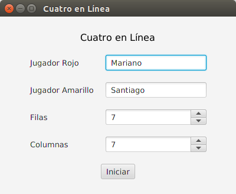
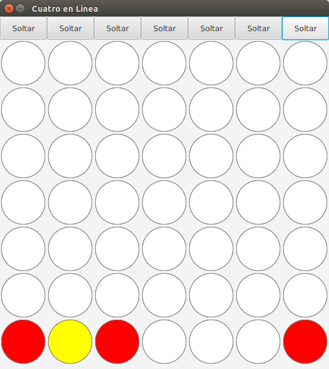

UNTreF - Algoritmos y Programación 1

# Trabajo Práctico: Cuatro en Lí­nea

## Problema

Completar el desarrollo de la aplicación Cuatro en Lí­nea.

## Enunciado

Implementar la clase `CuatroEnLinea` a partir de la siguiente especificación: 

[`CuatroEnLinea.java`](./src/juego/CuatroEnLinea.java).

[`Casillero.java`](./src/juego/Casillero.java)

### Pantallas

## Condiciones

El siguiente trabajo debe realizarse o en grupos de a lo sumo 3 personas, 
no se admitirán bajo ningún concepto entregas individuales o de grupos formados por 4 o más personas.

La fecha lí­mite de entrega del trabajo es: 

  * Comisión 1 - Lunes y Jueves: 26/11
  * Comisión 2 - Martes y Sábado: 28/11
  * Comisión 3 - Lunes y Miércoles: 25/11 

Los docentes usarán su propia baterí­a de pruebas (que respetan la misma interfaz, 
por lo que no deberán cambiar la firma de sus métodos públicos de la clase `CuatroEnLinea`).

En función a las pruebas que pasen, se asignará una nota al trabajo. 

También serán tenidos en cuenta aquellos trabajos que mejoren la gráfica de la aplicación.

El 60% de las pruebas garantiza la aprobación.

## Pruebas Unitarias

Se deben entregar pruebas unitarias intensivas de la clase desarrollada.

